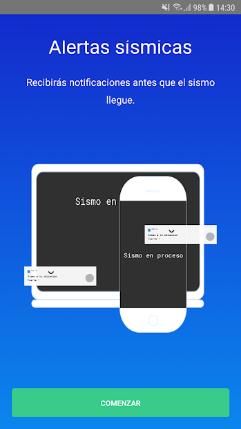
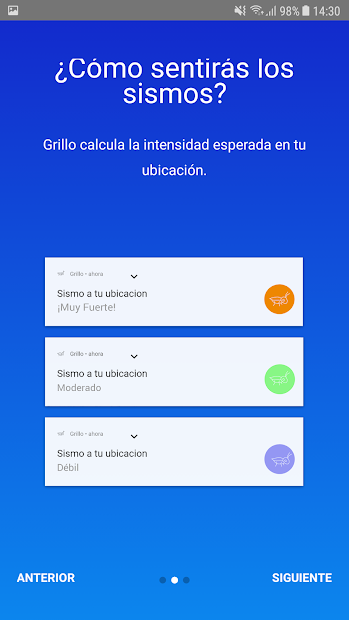
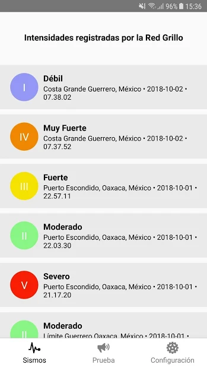

# React-Native Earthquake Early-Warning App
Create an earthquake early-warning (EEW) app that receives FCM notifications, and visualizes an API of historic earthquakes.

The user is registered through Firebase authentication, and the app uses the user location to calculate percieved intensity of an earthquake. This is done by calculating distance to the event and determining the loss in energy of the seismic.

The app also allows setting of country, testing of alarm, and browsing of previous alert events.

Alerts are only made to notify if they result in a user intensity of more than 'Debil' ie light.

---
### Screenshots

### Example Apps
You can download a free working example for Mexico and Chile here:
- [Android](https://play.google.com/store/apps/details?id=com.grillo.earthquakeapp&hl=es_MX)
- [iOS](https://apps.apple.com/us/app/grillo/id1437900025)
___

Enjoy!  Give us [feedback](https://github.com/grillo/openeew-nodered/issues) if you have suggestions on how to improve this tutorial.

## License

This tutorial is licensed under the Apache Software License, Version 2.  Separate third party code objects invoked within this code pattern are licensed by their respective providers pursuant to their own separate licenses. Contributions are subject to the [Developer Certificate of Origin, Version 1.1 (DCO)](https://developercertificate.org/) and the [Apache Software License, Version 2](http://www.apache.org/licenses/LICENSE-2.0.txt).
